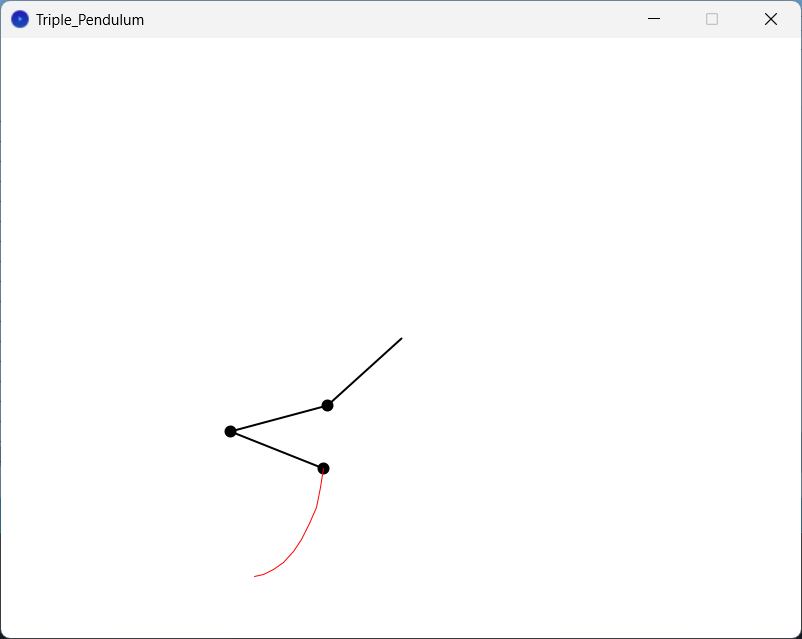

# TriplePendulum
An example of a HSIC (Highly Sensitive to Initial Condition) system. The double pendulum code was developed using C# and is numerically more accurate. In this one a new pendulum is added.

!ATTENTION: this code was written using Processing Java, go to the link below and download the program for running the program smoothly. I've uploaded uploaded some pictures to show the program
 <a href="processing.org">processing.org</a>
  

